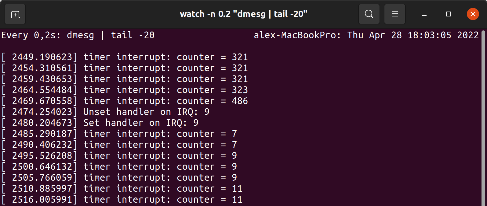

# Задача 2

Необходимо разработать модуль, который будет собирать статистику о пользователе, а именно считать сколько символов было набрано на клавиатуре за последнюю минуту и выводить этот результат в логи.
Для реализации этой идеи предлагается реализовать обработчик прерывания клавиатуры. Обратите внимание, что современные USB-клавиатуры не подойдут для выполнения задания, так как они не занимают IRQ линию непосредственно - вам понадобится PS/2 клавиатура, которая занимает IRQ = 1. При использовании виртуальной машины проблем с этим возникнуть не должно: они умеют эмулировать PS/2.

## Решение

Делаем хэндлер для прерывания клавиатуры, в нём делаем инкремент счётчика.

Используем функции `request_irq` с флагом `IRQF_SHARED`, `synchronize_irq` и `free_irq`.

Для того, чтобы выводить значения до таймеру, заведём ещё один колбэк, который будем добавлять в планировщик каждые `TIME_TO_WAIT` секунд. 

Используем следующие функции и макросы: `DECLARE_DELAYED_WORK`, `schedule_delayed_work` и `cancel_delayed_work_sync`.

Номер IRQ линии зависит от системы, на которой мы работаем. Например, под qemu - это 4, а на моей хостовой системе - 9.

Мы получаем сигнал на каждое нажаие и отпускание клавиши, поэтому счётчик кажды раз увеличивается на 2. Значения в логах dmesg обновляются каждые 5 секунд.

Пример работы:

