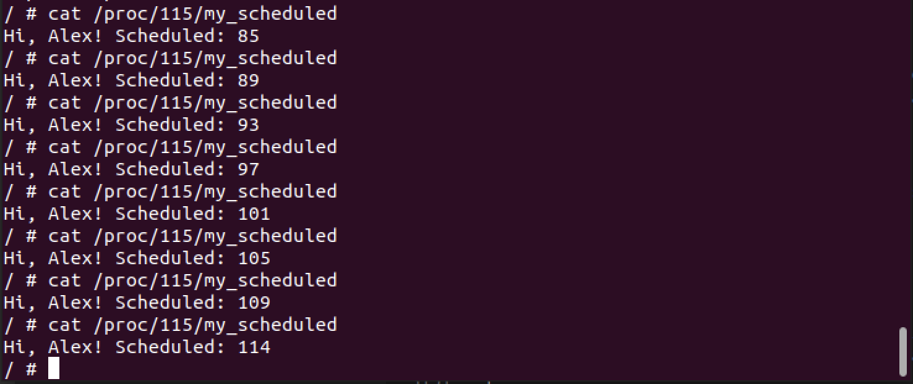

# Задача 3

Необходимо добавить в структуру `task_struct` новое поле, которое будет инкрементироваться каждый раз, когда процесс запланирован на выполнение. В `/proc/<xxx>/<new_field>` экспортировать значение этого поля.

## Решение

Добавим новое поле `unsigned long scheduled` в структуру `task_struct`. 

Создадим новый файл в файловой системе `proc` - `/proc/<xxx>/my_scheduled` и будем добавлять в него ранее созданное поле.

Инкрементировать поле будем в планировщике перед добавлением в очередь планирования.

Изменения в коде ядра можно посмотреть в файле [diff](./diff.diff).

### Пример работы

