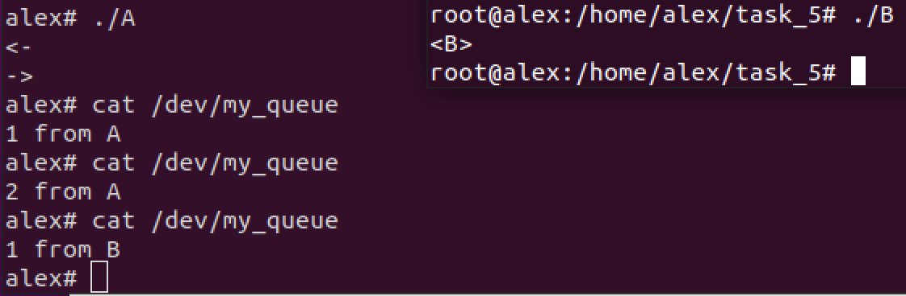

# Задача 5

Необходимо создать драйвер устройства для реализации FIFO среди процессов.

Надо сделать так, чтобы сообщения шли в том порядке в котором процессы открывали устройство.

Т.е. если процесс 1 открыл устройство на запись написал что-то, затем процесс 2 открыл устройство на запись, написал что-то, затем процесс 1 написал что-то снова, то при чтении из устройства мы должны прочитать то что написал процесс 1 раньше (оба сообщения), чем то что написал процесс 2.

## Решение

Создаём устройтво `my_queue`. Когда процесс его открывает, ему присваивается инкрементируемый тикет для поддержания требуемого порядка. Сообщение записывается в очередь (реализуемую списком) на требуемое место согласно тикету: все сообщения с большим тикетом идут после нас, а с тикетом не более нашего строго до нас. При чтеннии просто достаём первое сообщение из очереди.

### Пример работы

Былы создадны процессы [`A`](./A.c) и [`B`](./B.c). `A` пишет в устройтво `1 from A`, ждёт 8 секунд, затем пишет `2 from A`. Процесс `B` пишет в утройство `1 from B`. Процесс `B` будем запускать после первой записи `A`, строго до второй записи.

Как и требовалось, сначала мы прочитали оба сообщения из `A`, а затем уже из `B`.
